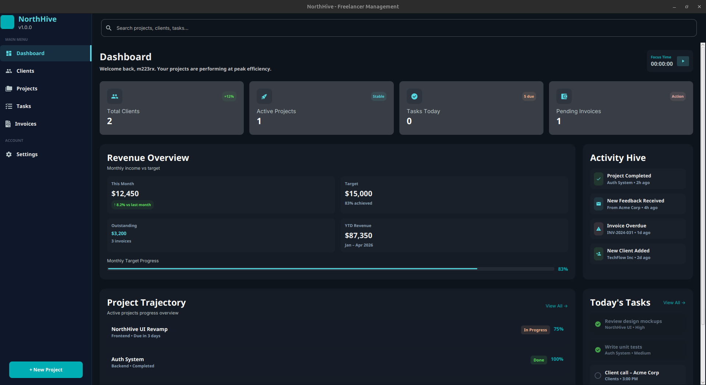

# NorthHive – Smart Project & Task Management Platform

---

## 🚀 Features  

- **Project Management System**  
  Create, manage, and organize multiple projects with structured workflows.

- **Task Tracking & Organization**  
  - Add, update, and delete tasks
  - Assign priorities and statuses
  - Track progress visually

- **Modern Desktop UI (JavaFX)**  
  Clean and responsive interface designed for productivity and clarity.

- **Authentication System**  
  Secure login and registration system with session handling.

- **Database Integration**  
  Persistent data storage using relational database design.

- **Real-Time UI Updates**  
  Dynamic rendering of tasks and projects without restarting the app.

- **Modular Architecture (MVC)**  
  Well-structured codebase separating:
  - Controllers
  - Models
  - Data Access Objects (DAO)

- **Dialog & UX Helpers**  
  User-friendly alerts, confirmations, and feedback system.

---

## 🛠 Tech Stack

- **Frontend (Desktop)**
    - [JavaFX](https://openjfx.io/) – UI framework
    - [FXML](https://openjfx.io/javadoc/22/javafx.fxml/javafx/fxml/doc-files/introduction_to_fxml.html) – UI structure
    - [CSS](https://developer.mozilla.org/en-US/docs/Web/CSS) – Styling

- **Backend:**  
  - [Java](https://www.java.com/en/) – Core application logic
  - [MySQL](https://www.mysql.com/) – Database management
  

---

## 💡 Future Enhancements

- Drag & drop task management
- Real-time collaboration (multi-user sync)
- Notifications & reminders system
- File attachments for tasks
- Role-based access control (admin/user)
- Cloud sync & backup

---

## ⚠️ Status

- **This project is currently in active development**
- Core features are functional
- UI/UX improvements are ongoing
- Planned expansion into a full ecosystem (desktop + mobile + API)

## 👨‍💻 Developer

m223rx – 2026

© 2026 m223rx. All rights reserved.
